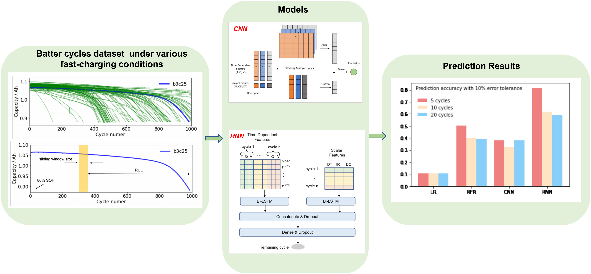

# Battery-Lifetime-Prediction-with-Limited-Cycle-Data
Applied machine-learning models, including linear regression, random forest regression, convolutional neural networks, and recurrent neural networks to make predictions on cell life. 

## Description
Accurately predicting the remaining useful lifetime of batteries is critical for accelerating technological development and creating a paradigm shift in battery usage. Data-driven approaches,based on large datasets, provide a physical-model agnostic way to predict the health status of batteries with high accuracy. However, most datadriven methods on battery life prediction often rely on features extracted from a hundred cycles worth of data for a given cell, making it computationally inefficient and incompatible with on-board application.

The course project (CS 329P Practical Machine Learning) applied machine-learning models, including linear regression, random forest regression, convolutional neural networks, and recurrent neural networks to make predictions on cell life. Our best model achieve a 7.5% prediction error given the data of only 5 cycles.
